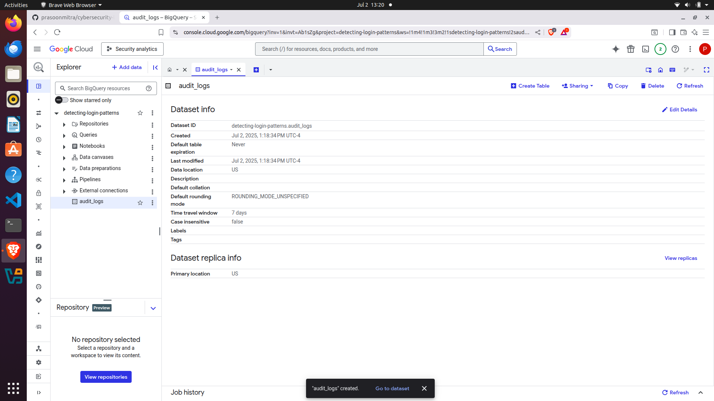
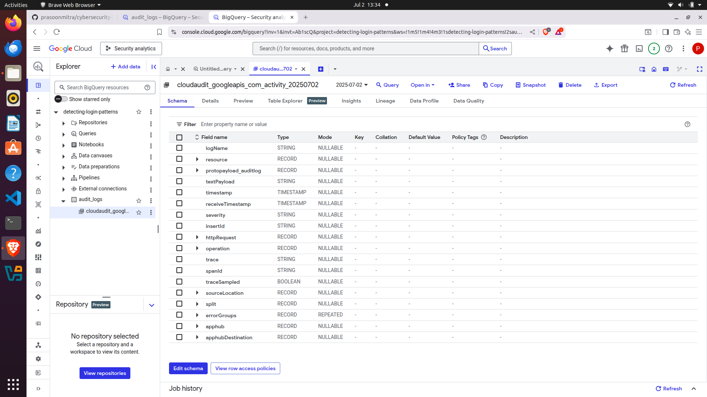
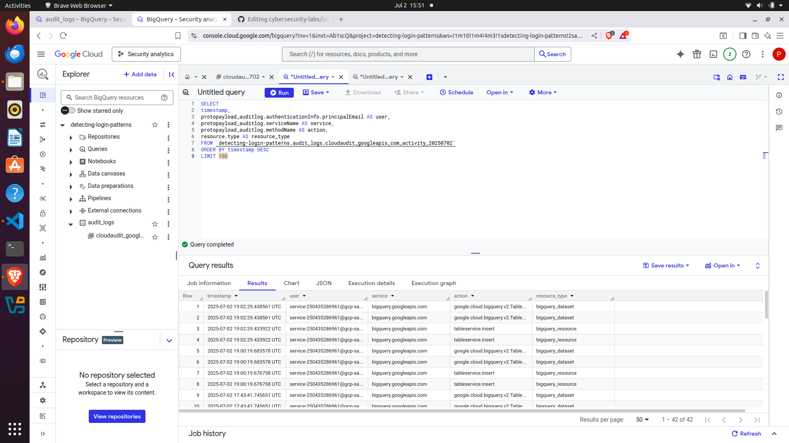

GCP Cloud Audit Logs Security Analysis

Purpose:  to capture, store, and analyze GCP audit logs using cloud logging, BigQuery, and SQL queries to analyze data that is relevant to cloud security. 
 - Cloud Audit logs tell a security analyst what activity is going on inside the cloud.

Step 1: Make sure APIs are enabled
  - Cloud Logging
  - BigQuery API

Step 2: Creating the dataset (audit_logs) so we can see the logs that will be exported later on.

Step 3: Log Router to complete the process of exporting to BigQuery
  - Went to Google Cloud Observability Logging
  - Selected Log Router and created the log routing sink
  - This provided the destination for the data to arrive at (BigQuery)

Step 4: Data has arrived so now we can query the audit logs in SQL to find insights.

Purpose of Query 1: Showing the recent user activity in my GCP Project - useful for security analysts to monitor any suspicious activity

Query:
SELECT  
timestamp,
protopayload_auditlog.authenticationInfo.principalEmail AS user,
protopayload_auditlog.serviceName AS service,
protopayload_auditlog.methodName AS action,
resource.type AS resource_type
FROM detecting-login-patterns.audit_logs.cloudaudit_googleapis_com_activity_YYYYYYYY
ORDER BY timestamp DESC
LIMIT 100

Line by Line analysis:
SELECT statement : identifies which fields to analyze
timestamp : the time when the action occured
protopayload_auditlog.authenticationInfo.principalEmail AS user: The email is recorded and is stated under the "user" column
protopayload_auditlog.serviceName AS service : The GCP Service that was accessed is recorded and is stated under the "service" column
protopayload_auditlog.methodName AS action : The GCP API method that was accessed is recorded and is stated under the "action" column
resource.type AS resource_type: The type of resource that was accessed is recorded and is stated under the "resource_type" column
FROM `detecting-login-patterns.audit_logs.cloudaudit_googleapis_com_activity_YYYYYYYY: From my source table and project ID
ORDER BY timestamp DESC: Orders the data by most recent activity first
LIMIT 100: 100 records of data

Purpose of Query 2: Showing the new resources that are created in my GCP Project - useful for detecting malicious activity

Query:
SELECT  
timestamp,
protopayload_auditlog.authenticationInfo.principalEmail AS user,
protopayload_auditlog.methodName AS action,
protopayload_auditlog.resourceName AS resource
FROM detecting-login-patterns.audit_logs.cloudaudit_googleapis_com_activity_YYYYYYYY 
WHERE protopayload_auditlog.methodName LIKE "%insert%"
ORDER BY timestamp DESC

Line by Line analysis:
SELECT statement : identifies which fields to analyze
timestamp : the time when the action occured
protopayload_auditlog.authenticationInfo.principalEmail AS user: The email is recorded and is stated under the "user" column
protopayload_auditlog.methodName AS action: The GCP API method that was accessed is recorded and is stated under the "action" column
protopayload_auditlog.resourceName AS resource: The full name of the resoruce that was accessed is recorded and is stated under the "resource_type" column
FROM `detecting-login-patterns.audit_logs.cloudaudit_googleapis_com_activity_YYYYYYYY : From my source table and project ID
WHERE protopayload_auditlog.methodName LIKE "%insert%" : Filters events based on the method having "insert" in its name - *new resource creation*
ORDER BY timestamp DESC - Orders the data by most recent activity first

